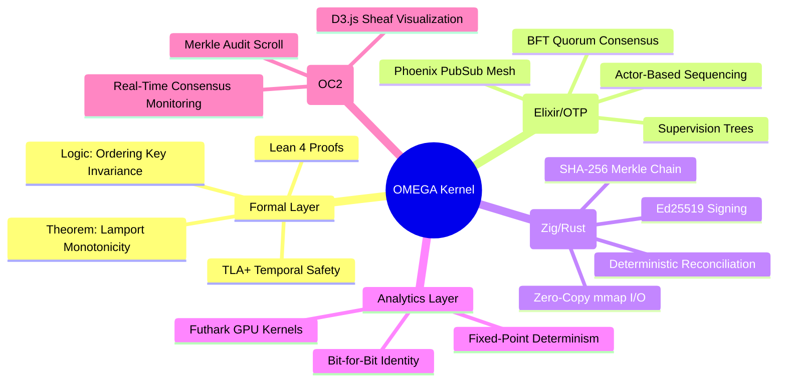
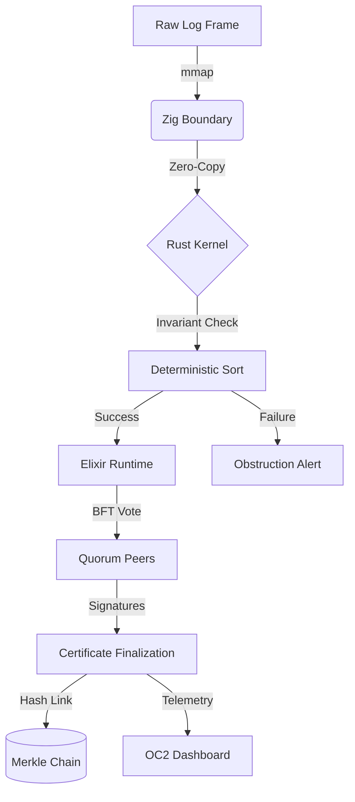
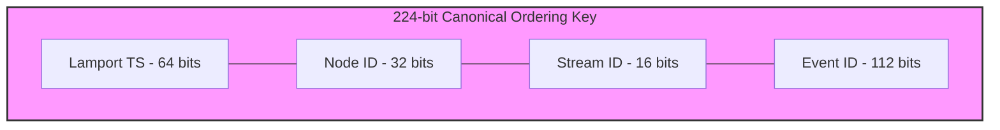

# 🫀 OMEGA-SHEAF-OS

[](https://opensource.org/licenses/Apache-2.0)
[](https://www.rust-lang.org/)
[](https://lean-lang.org/)
[](https://elixir-lang.org/)

**A High-Integrity Distributed Consistency Kernel with Multi-Layer Formal Verification.**

OMEGA-SHEAF-OS is a "Truth Engine" designed to convert non-deterministic distributed event streams into an immutable, cryptographically signed, and formally verified chain of certificates. It operates on the principle that distributed consistency should be a **mathematical certainty**, not a network convention.

---

## 🚀 Key Features

- **Formal Verification**: Logic proven in Lean 4 and TLA+ model checking.
- **Deterministic Reconciliation**: Arrival-time independent state construction via a 224-bit Canonical Ordering Key.
- **Zero-Copy Systems Layer**: High-performance I/O using `mmap` and Zig boundaries.
- **BFT Quorum Consensus**: Synchronous certificate finalization via Elixir/OTP.
- **Architecture-Agnostic Analytics**: Fixed-point arithmetic in Futhark for bit-for-bit identity across hardware (Intel vs. ARM).
- **OC2 Command Center**: High-density D3.js visualization of the "Causal Sheaf Map".

---

## 🏛 Deep Architecture Map

### 1. The Logical Gauntlet (Mind Map)
The system ensures that data survives a multi-layered verification process before being finalized.



### 2. The Verification Pipeline (Flowchart)
How a raw log frame becomes a finalized certificate of truth.



---

## 📐 Mathematical & Logical Foundations

### 1. The Canonical Ordering Key (224-bit)
To ensure arrival-time independence, every event is sorted by a 224-bit key. This ensures that any two nodes in the universe, given the same set of events, will reach the **exact same state hash**.



$$K = (Lamport_{64} \ll 160) | (NodeID_{32} \ll 128) | (StreamID_{16} \ll 112) | (EventID_{112})$$

### 2. Formal Monotonicity (Lean 4)
In `layers/lean4/Formal/OMEGA.lean`, we formally prove that for any list of events $L$, if $L$ is sorted by $K$, then for any two events $a, b \in L$ where $a$ precedes $b$, $a.lamport \le b.lamport$. This establishes the "Arrow of Time" as a mathematical constant.

### 3. Fixed-Point Analytics (Futhark)
To prevent non-determinism caused by CPU-specific floating-point rounding, all analytics utilize **Fixed-Point Arithmetic**. Values are stored as `i32` with a $10^{3}$ scaling factor, ensuring 100% bit-for-bit identity across disparate hardware architectures.

---

## 🛠 Toolchain & Installation

### Requirements
- **Rust**: `1.75+` (Toolchain: `wasm32-unknown-unknown`)
- **Elixir**: `1.16+` (Erlang/OTP 26+)
- **Zig**: `0.13.0`
- **Lean**: `Lean 4` (via `elan`)
- **Futhark**: `0.25+`
- **Node.js**: `20+` (For OC2 Dashboard)

### Installation (Ubuntu/Debian)
```bash
# Install core dependencies
curl --proto '=https' --tlsv1.2 -sSf https://sh.rustup.rs | sh
sudo apt install elixir zig-compiler nodejs npm

# Install Lean 4
curl https://raw.githubusercontent.com/leanprover/elan/master/elan-init.sh -sSf | sh

# Clone and setup
git clone https://github.com/your-org/omega-sheaf-os.git
cd omega-sheaf-os
./scripts/build_all.sh
```

---

## 📦 Project Structure

```text
.
├── crates/             # Rust Workspace
│   ├── omega-core/     # Reconciliation & Invariants
│   └── omega-cli/      # Command-line Interface
├── layers/             # Specialized Logic Layers
│   ├── elixir/         # Distributed Runtime & Quorum
│   ├── lean4/          # Formal Mathematical Proofs
│   ├── zig/            # Systems I/O (mmap)
│   ├── futhark/        # GPU-Accelerated Analytics
│   └── tla/            # Temporal Logic Specification
├── ui/                 # OC2 Dashboard (React/D3.js)
├── schemas/            # Binary Contract Definitions
└── scripts/            # Build & Deployment Tools
```

---

## 🕹 Quick Start & CLI Reference

### Ingesting & Certifying a Log
```bash
# 1. Ingest raw log and validate CRC32
omega ingest --input logs/sample.omega

# 2. Reconcile events into a deterministic state
omega reconcile --input logs/events.json --output results.json

# 3. Produce a signed BFT certificate
omega certify --result results.json --output cert.bin --cert-log chain.log
```

### CLI Commands Reference
| Command | Description |
|---|---|
| `ingest` | Maps a log and validates CRC32 frame boundaries. |
| `reconcile` | Assembles a deterministic state from event sets. |
| `certify` | Produces a signed, binary-packed truth certificate. |
| `replay` | Validates deterministic replay from a snapshot + log. |
| `explain` | Decodes binary certificates into readable telemetry. |
| `doctor` | Validates the 6-layer toolchain availability. |

---

## 🖥 OC2: The Command Center

The OMEGA Command Center (OC2) is a high-density observability platform.

1.  **Causal Sheaf Map**: Force-directed graph of event dependencies.
2.  **Quorum Monitor**: Real-time BFT signature gathering.
3.  **Merkle Audit Scroll**: Timeline of the `prev_cert_hash` chain.

### Launch OC2
```bash
# Build and start the cluster + UI
./scripts/start_command_center.sh

# Access via Browser: http://localhost:4000
```

---

## ⚖️ Legal & Licensing
**License**: Apache-2.0.
**Disclaimer**: This is a high-integrity formal reference. It is designed for environments where consistency is the primary directive.
