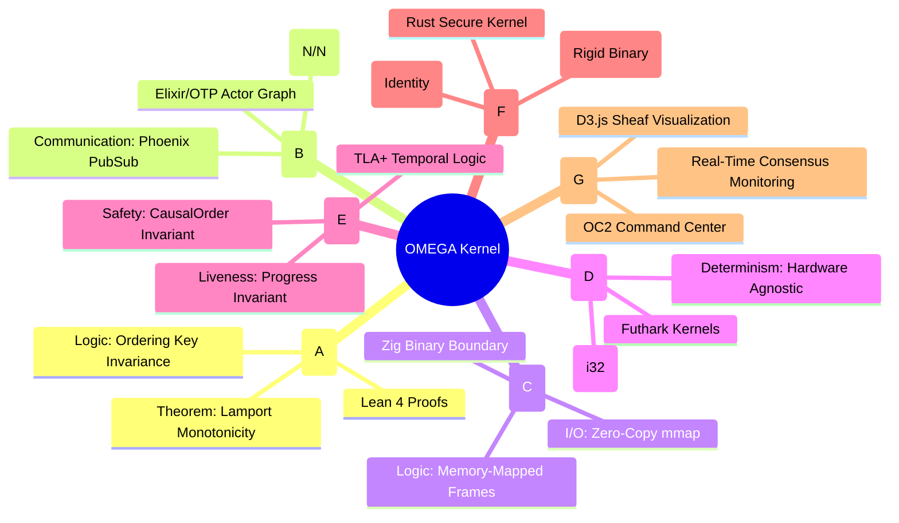
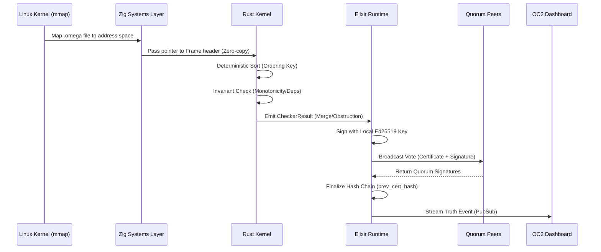

# OMEGA-SHEAF-OS: Technical Specification & Architectural Manifesto

**A High-Integrity Distributed Consistency Kernel with Multi-Layer Formal Verification.**

OMEGA-SHEAF-OS is a "Truth Engine" designed to convert non-deterministic distributed event streams into an immutable, cryptographically signed, and formally verified chain of certificates. It operates on the principle that distributed consistency should be a **mathematical certainty**, not a network convention.

---

## 🏛 Deep Architecture Map

### 1. Verification Mind Map (The Logical Gauntlet)
The system ensures that data survives a "Gauntlet of Truth" before being finalized.



---

## 🔄 Lifecycle of a Causal Event

This sequence diagram illustrates the transition from a raw binary frame to a BFT-finalized certificate.



---

## 📐 Mathematical & Logical Foundations

### 1. The Canonical Ordering Key
To ensure arrival-time independence, every event is sorted by a 224-bit key before reconciliation:
$$K = (Lamport_{64} \ll 160) | (NodeID_{32} \ll 128) | (StreamID_{16} \ll 112) | (EventID_{112})$$
This ensures that any two nodes in the universe, given the same set of events, will reach the **exact same state hash**.

### 2. Formal Monotonicity (Lean 4)
In `layers/lean4/Formal/OMEGA.lean`, we formally prove that for any list of events $L$, if $L$ is sorted by $K$, then for any two events $a, b \in L$ where $a$ precedes $b$, $a.lamport \le b.lamport$. This establishing the "Arrow of Time" as a mathematical constant.

### 3. Fixed-Point Analytics (Futhark)
To prevent non-determinism caused by CPU-specific floating-point rounding (Intel vs ARM), all analytics utilize **Fixed-Point Arithmetic**. Values are stored as `i32` with a $10^{3}$ scaling factor. 
*   **Result**: 100% bit-for-bit identity across disparate hardware architectures.

---

## 📦 Technical Implementation Details

### 1. Zero-Copy `mmap` Strategy
Traditional I/O copies data from the disk to the kernel, then to the application buffer. OMEGA uses the `mmap` syscall in both Zig and Rust:
*   The `.omega` file is mapped directly into the CPU's virtual address space.
*   The `OmegaLogView` struct treats the disk as a raw `&[u8]` slice.
*   **Performance**: Zero CPU cycles spent on copying; throughput is limited only by the NVMe/Memory bus.

### 2. Rigid Binary Contracts
We have eliminated JSON for internal certification. The `CertificateEnvelope` is a packed binary structure:
| Field | Type | Bits |
|---|---|---|
| `cert_id` | u128 | 128 |
| `cert_type` | u8 | 8 |
| `trace_root_hash` | [u8; 32] | 256 |
| `batch_id` | u64 | 64 |
| `body_hash` | [u8; 32] | 256 |
| `prev_cert_hash` | [u8; 32] | 256 |

### 3. BFT Quorum Consensus
The Elixir layer implements a synchronous quorum collector:
*   **Node Identity**: Managed by persistent Ed25519 keys (`omega.key`).
*   **Quorum Threshold**: Requires $N$ signatures for a cluster of size $N$.
*   **Finalization**: A certificate is only committed to `cert.log` once the `quorum_signatures` array is populated and verified.

---

## 🛠 Command Reference & Toolchain

### CLI Commands
| Command | Flag | Description |
|---|---|---|
| `ingest` | `--input` | Maps a log and validates CRC32 frame boundaries. |
| `reconcile` | `--batch-id` | Assembles a deterministic state from event sets. |
| `certify` | `--output` | Produces a signed, binary-packed truth certificate. |
| `explain` | `--input` | Decodes binary certificates into readable telemetry. |
| `doctor` | `--root` | Validates the 6-layer toolchain availability. |

### Toolchain Requirements
*   **Rust**: `1.75+` (Workspace, edition 2021)
*   **Elixir**: `1.16+` (Erlang/OTP 26+)
*   **Zig**: `0.13.0` (Standard library only)
*   **Lean**: `Lean 4` (via `elan`)
*   **Futhark**: `0.25+`
*   **Node.js**: `20+` (For OC2 Dashboard)

---

## 🖥 OC2: The Command Center

The OMEGA Command Center (OC2) is a high-density observability platform.

### Key Visual Interpreters
1.  **Causal Sheaf Map**: A real-time D3 force-directed graph. 
    *   **Nodes**: Represent Events and Certificates.
    *   **Edges**: Represent Causal Dependencies (`deps[]`).
    *   **Alerts**: Conflicting nodes (Obstructions) flash in Alert-Red (#ff003c).
2.  **Quorum Monitor**: Visualizes the "Signature Gathering" phase of the BFT consensus.
3.  **Merkle Audit Scroll**: A horizontal timeline of the `prev_cert_hash` chain, allowing for "Point-in-Time" integrity audits.

### Deployment
```bash
# 1. Full Build (Rust, Zig, Lean, Elixir, UI)
./scripts/build_all.sh

# 2. Launch Background Cluster
./scripts/start_command_center.sh

# 3. Access Truth Platform
# UI: http://localhost:4000
# API: http://localhost:4000/api/status
```

---

## ⚖️ Legal & Licensing
**License**: Apache-2.0.
**Disclaimer**: This is a high-integrity formal reference. It is designed for environments where consistency is the primary directive.