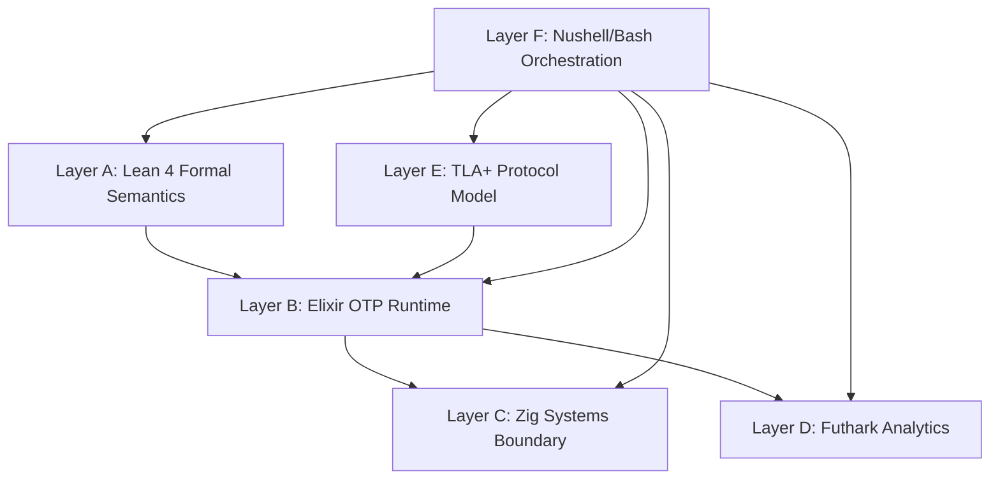
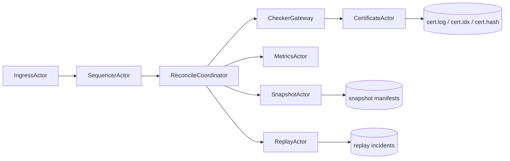
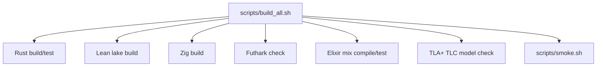

# OMEGA-SHEAF-OS

Formal-methods-backed distributed consistency kernel with deterministic reconciliation,
cryptographically signed certification, replay validation, model checking, and
multi-language architecture layers.

## Mission Statement

OMEGA-SHEAF-OS exists to make distributed consistency a chain of enforceable contracts,
not a convention.

The system is designed so each accepted or rejected merge can be justified by:

1. deterministic ordering and compatibility checks,
2. checker-binding metadata (checker/schema/predicate hashes),
3. machine-readable certificates,
4. replayable evidence trails,
5. formal/model-checked artifacts.

## Executive Summary

This repository includes a working reference system that can:

1. ingest `.omega` files,
2. reconcile event sets deterministically,
3. emit merge/obstruction checker results with binding metadata,
4. certify outcomes with signature + hash-chain context,
5. replay and detect deterministic mismatches,
6. run strict multi-layer build checks.

## Visual Architecture Map

### Layer Stack



### Runtime Flow



### Build and Verification Graph



## Repository Map

```text
omega-sheaf-os/
├── crates/
│   ├── omega-core/            # Deterministic core logic + checker/cert/replay primitives
│   └── omega-cli/             # `omega` command-line entrypoint
├── layers/
│   ├── lean4/                 # Formal semantics/checker model
│   ├── elixir/runtime/        # Layer B OTP actor runtime
│   ├── zig/                   # Binary/system-boundary primitives
│   ├── futhark/               # Analytics kernels
│   ├── tla/                   # Model-check spec + cfg
│   ├── nushell/               # Pipeline orchestration
│   └── pony/                  # Legacy optional runtime reference
├── schemas/                   # JSON schema mirrors (event/certificate)
├── configs/                   # Predicate catalog
├── docs/                      # Formal/runtime design docs
├── scripts/                   # Build, smoke, architecture checks
├── examples/                  # Sample inputs
└── artifacts/                 # Manifest template
```

## Dependency Matrix (Everything You Need)

## System Toolchains (Required for strict full stack)

| Tool | Purpose |
|---|---|
| `cargo`, `rustc` | Build/test Rust core + CLI |
| `zig` | Build Layer C system boundary |
| `lake`, `lean` | Build Layer A formal model |
| `futhark` | Check Layer D analytics kernels |
| `elixir`, `mix` | Build/test Layer B runtime |
| `java`, `tlc` | Run Layer E model checking |
| `nu` | Run Nushell pipeline |
| `bash` | Run shell orchestration scripts |

## Optional Toolchains

| Tool | Role |
|---|---|
| `ponyc` | Legacy Pony layer (non-blocking/optional) |

## Debian Install (Reference)

```bash
sudo apt-get update
sudo apt-get install -y \
  build-essential curl git \
  elixir erlang \
  openjdk-21-jre
```

Install remaining toolchains from your preferred channel and verify with `omega doctor`:

1. `zig`
2. `futhark`
3. `lean` + `lake` (typically via `elan`)
4. `nu` (Nushell)

## Rust Direct Dependencies (Workspace)

From `Cargo.toml`:

1. `anyhow`
2. `blake3`
3. `clap` (`derive`)
4. `crc32fast`
5. `ed25519-dalek` (`rand_core`)
6. `hex`
7. `rand`
8. `serde` (`derive`)
9. `serde_json`
10. `thiserror`
11. `time` (`formatting`, `parsing`, `macros`)
12. `uuid` (`v4`, `serde`)

To inspect full transitive Rust dependency graph locally:

```bash
cargo tree --workspace
```

## Elixir Runtime Dependencies

`layers/elixir/runtime/mix.exs` currently declares no third-party Hex deps (`deps: []`).
It uses OTP standard library only.

## Build Modes

## Standard Build

```bash
./scripts/build_all.sh
```

Runs full stack checks but tolerates environment-specific constraints with graceful fallbacks.

## Strict Build

```bash
./scripts/build_all.sh --strict
```

Fails if required toolchains/layer checks are unavailable or fail.

## Pipeline Environment Variables

| Variable | Scope | Default | Meaning |
|---|---|---|---|
| `OMEGA_RUN_TLC` | build scripts | `0` | Run TLC even in non-strict mode when set to `1` |
| `OMEGA_BATCH_SIZE` | Elixir runtime | `32` | Reconcile batch size threshold |
| `OMEGA_FLUSH_MS` | Elixir runtime | `100` | Reconcile flush timer |
| `OMEGA_METRICS_DIR` | Elixir runtime | `/tmp/omega-runtime` | Metrics JSONL output directory |
| `OMEGA_CERT_DIR` | Elixir runtime | `/tmp/omega-runtime/certs` | Certificate append-store directory |
| `OMEGA_SNAPSHOT_DIR` | Elixir runtime | `/tmp/omega-runtime/snapshots` | Snapshot output directory |
| `OMEGA_REPLAY_DIR` | Elixir runtime | `/tmp/omega-runtime/replay` | Replay incident directory |

## Command Reference (`omega` CLI)

All commands emit structured JSON to stdout.

## `omega ingest`

Validates `.omega` header + frame prefix integrity.

```bash
omega ingest --input examples/sample.omega
```

## `omega generate-events`

Generates deterministic valid event arrays for testing/smoke.

```bash
omega generate-events --output /tmp/events.json --count 5
```

## `omega reconcile`

Runs checker with deterministic sort and emits checker output + binding metadata.

```bash
omega reconcile \
  --input /tmp/events.json \
  --batch-id 10 \
  --replay-seed 99 \
  --output /tmp/reconcile.json
```

## `omega certify`

Validates checker bindings and creates signed certificate envelopes.

```bash
omega certify \
  --result /tmp/reconcile.json \
  --batch-id 10 \
  --replay-seed 99 \
  --schema-version 1 \
  --output /tmp/cert.json \
  --cert-log /tmp/cert.log
```

## `omega replay`

Checks deterministic replay hash against expected digest.

```bash
omega replay \
  --snapshot examples/snapshot.json \
  --log_suffix examples/log_suffix.bin \
  --expected_hash_hex <64-hex-bytes>
```

## `omega explain`

Classifies and summarizes a checker/certificate JSON artifact.

```bash
omega explain --input /tmp/cert.json
```

## `omega bench`

Generates synthetic events and benchmarks checker throughput.

```bash
omega bench --events 100000
```

## `omega doctor`

Verifies file layout and toolchain availability.

```bash
omega doctor --root .
```

## `omega export-metrics`

Re-shapes metrics lines into normalized JSONL records with sequence IDs.

```bash
omega export-metrics --input /tmp/in.jsonl --output /tmp/out.jsonl
```

## End-to-End Quickstart

```bash
cd /home/x123la/repos/omega-sheaf-os
./scripts/build_all.sh --strict
```

Manual sequence:

```bash
./scripts/make_sample_log.sh examples/sample.omega
omega ingest --input examples/sample.omega
omega generate-events --output /tmp/events.json --count 3
omega reconcile --input /tmp/events.json --batch-id 1 --replay-seed 99 --output /tmp/reconcile.json
omega certify --result /tmp/reconcile.json --batch-id 1 --replay-seed 99 --schema-version 1 --output /tmp/cert.json --cert-log /tmp/cert.log
omega explain --input /tmp/cert.json
omega doctor --root .
```

## Data Model and Contracts

## Canonical Ordering Key

Authoritative ordering across runtime paths:

```text
(lamport, node_id, stream_id, event_id)
```

## Event Schema

See `schemas/event.schema.json`.
Core fields:

1. `event_id` (`u128` domain)
2. `node_id` (`u32` domain)
3. `stream_id` (`u16` domain)
4. `lamport` (`u64`)
5. `deps` (event dependency IDs)
6. `payload` + `payload_hash`

## Certificate Schema

See `schemas/certificate.schema.json`.
Core envelope fields:

1. `cert_id`
2. `cert_type` (`Merge` or `Obstruction`)
3. `checker_version`
4. `schema_version`
5. `body_hash`
6. `signature`
7. `prev_cert_hash`

## Predicate Catalog

See `configs/predicate_catalog.json`.
Current examples:

1. `1001`: lamport monotonic
2. `1002`: event unique
3. `2001`: payload hash match
4. `2002`: dependency known
5. `3001`: overlap agreement

## Conformance and Integrity Matrix

| Capability | Status | Evidence |
|---|---|---|
| Deterministic ordering | Implemented | `crates/omega-core/src/reconcile.rs` |
| Duplicate and dependency checks | Implemented | `crates/omega-core/src/reconcile.rs` |
| Checker-binding metadata | Implemented | `crates/omega-core/src/checker.rs` |
| Binding validation before certification | Implemented | `crates/omega-cli/src/main.rs` |
| Signed certificates + chain linkage | Implemented | `crates/omega-core/src/cert.rs`, Elixir cert actor |
| `.omega` frame CRC recovery | Implemented | `crates/omega-core/src/log.rs` |
| Replay mismatch incidents | Implemented | `crates/omega-core/src/replay.rs`, Elixir replay actor |
| Elixir Layer B actor graph | Implemented | `layers/elixir/runtime/lib/omega_runtime/*.ex` |
| TLA+ model-check artifact | Implemented | `layers/tla/OMEGA.tla`, `layers/tla/OMEGA.cfg` |
| Lean theorem depth | Minimal reference baseline | `layers/lean4/Formal/OMEGA.lean` |

## Operational Storage Map

| Path | Producer | Contents |
|---|---|---|
| `/tmp/omega-runtime/metrics.jsonl` | `MetricsActor` | Monotonic metrics stream |
| `/tmp/omega-runtime/certs/cert.log` | `CertificateActor` | Append-only cert envelope stream |
| `/tmp/omega-runtime/certs/cert.idx` | `CertificateActor` | `cert_id -> offset` side index |
| `/tmp/omega-runtime/certs/cert.hash` | `CertificateActor` | Rolling cert hash chain |
| `/tmp/omega-runtime/snapshots/*.bin` | `SnapshotActor` | Snapshot manifests |
| `/tmp/omega-runtime/replay/*.bin` | `ReplayActor` | Replay incident records |

## Testing and Quality Gates

## Rust

```bash
cargo test --workspace
```

Covers:

1. checker binding behavior,
2. reconciliation success/failure paths,
3. log recovery semantics.

## Elixir

```bash
cd layers/elixir/runtime
mix test
```

In restricted environments where Mix PubSub socket is denied, pipeline falls back to:

```bash
elixirc -o <tmpdir> lib/omega_runtime.ex lib/omega_runtime/*.ex
```

## Model Checking (TLA+)

```bash
tlc -cleanup -deadlock -config layers/tla/OMEGA.cfg layers/tla/OMEGA.tla
```

## Troubleshooting Guide

## `elixir/mix unavailable`

```bash
sudo apt-get install -y elixir erlang
hash -r
command -v elixir
command -v mix
```

## `mix` fails with socket `:eperm` in restricted sandbox

This can happen in sandboxed CI/sessions. Use:

1. non-strict build, or
2. fallback compile check (`elixirc`) already wired in pipeline.

## TLC failures in restricted environments

Use:

```bash
OMEGA_RUN_TLC=1 ./scripts/build_all.sh
```

If networking/socket restrictions block TLC internals, run TLC in a less-restricted shell.

## Stale smoke artifacts

Smoke now writes to unique temp directories `/tmp/omega-smoke.*`.

## Security Notes

1. Hashing is used for payload/body/digest chaining (`BLAKE3` in Rust core; SHA-256 in Elixir runtime actors).
2. Signatures are Ed25519 in Rust cert path.
3. Certificate chain continuity is represented via `prev_cert_hash`.
4. Input logs are treated as untrusted and validated before use.

## Performance Notes

1. Deterministic sort is `O(n log n)` per batch.
2. Dependency checks are set-based and near linear after sort.
3. Batch sizing and flush interval are tunable by environment variables.
4. `omega bench` is intended for local envelope-level throughput checks.

## File Index (Core)

### Rust Core

1. `crates/omega-core/src/model.rs`
2. `crates/omega-core/src/reconcile.rs`
3. `crates/omega-core/src/checker.rs`
4. `crates/omega-core/src/cert.rs`
5. `crates/omega-core/src/log.rs`
6. `crates/omega-core/src/replay.rs`

### Rust CLI

1. `crates/omega-cli/src/main.rs`

### Elixir Runtime

1. `layers/elixir/runtime/lib/omega_runtime/application.ex`
2. `layers/elixir/runtime/lib/omega_runtime/ingress_actor.ex`
3. `layers/elixir/runtime/lib/omega_runtime/sequencer_actor.ex`
4. `layers/elixir/runtime/lib/omega_runtime/reconcile_coordinator.ex`
5. `layers/elixir/runtime/lib/omega_runtime/checker_gateway.ex`
6. `layers/elixir/runtime/lib/omega_runtime/certificate_actor.ex`
7. `layers/elixir/runtime/lib/omega_runtime/snapshot_actor.ex`
8. `layers/elixir/runtime/lib/omega_runtime/replay_actor.ex`
9. `layers/elixir/runtime/lib/omega_runtime/metrics_actor.ex`

### Formal/Model Layers

1. `layers/lean4/Formal/OMEGA.lean`
2. `layers/tla/OMEGA.tla`
3. `layers/tla/OMEGA.cfg`

### Systems/Analytics Layers

1. `layers/zig/src/lib.zig`
2. `layers/zig/src/cert_store.zig`
3. `layers/futhark/kernels.fut`

### Orchestration

1. `scripts/build_all.sh`
2. `layers/nushell/pipeline.nu`
3. `scripts/smoke.sh`
4. `scripts/check_architecture.sh`

## FAQ

## Is this production-ready?

It is a strong reference implementation with strict deterministic and certificate flows.
For formal-proof depth and large-scale distributed deployment hardening, continue expanding Layer A theorems and multi-node runtime integration.

## Why both Rust and Elixir runtime logic?

Rust currently provides the deterministic core and CLI reference. Elixir provides an actor-oriented Layer B runtime path aligned to the architecture mandate.

## Why keep Pony?

`layers/pony` remains a legacy non-blocking reference for historical architecture lineage.

## License

Apache-2.0 (workspace metadata).
