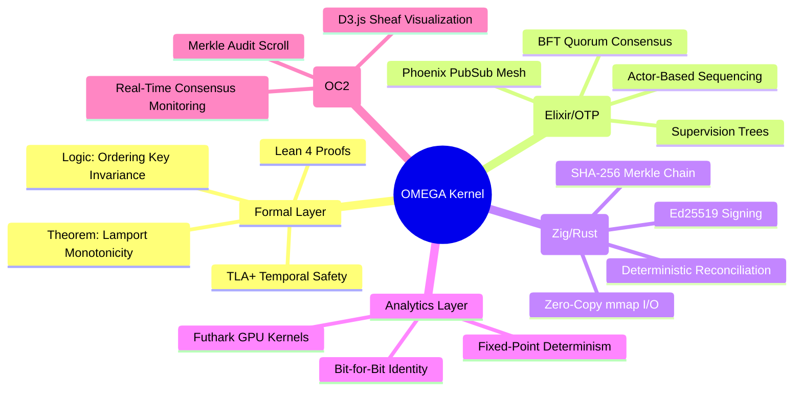
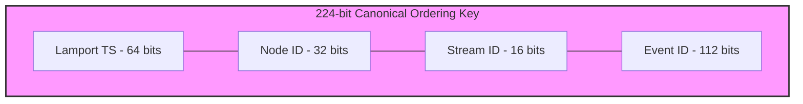

# 🫀 OMEGA-SHEAF-OS

[](https://opensource.org/licenses/Apache-2.0)
[](https://www.rust-lang.org/)
[](https://lean-lang.org/)
[](https://elixir-lang.org/)
[](https://ziglang.org/)

**A High-Integrity Distributed Consistency Kernel with Multi-Layer Formal Verification.**

OMEGA-SHEAF-OS is a "Truth Engine" designed to convert non-deterministic distributed event streams into an immutable, cryptographically signed, and formally verified chain of certificates. It operates on the principle that distributed consistency should be a **mathematical certainty**, not a network convention.

---

## 📖 Table of Contents
- [Executive Summary](#-executive-summary)
- [The Problem: The Fragility of Distributed Truth](#-the-problem-the-fragility-of-distributed-truth)
- [Core Architecture: The 7-Layer Gauntlet](#-core-architecture-the-7-layer-gauntlet)
- [Mathematical Foundations](#-mathematical-foundations)
- [Technical Deep Dives](#-technical-deep-dives)
  - [Zero-Copy Systems (Zig/Rust)](#zero-copy-systems-zigrust)
  - [Distributed Consensus (Elixir/OTP)](#distributed-consensus-elixirotp)
  - [Formal Logic (Lean 4/TLA+)](#formal-logic-lean-4tla)
- [Installation & Setup](#-installation--setup)
- [Usage & CLI Reference](#-usage--cli-reference)
- [OC2: Observability & Monitoring](#-oc2-observability--monitoring)
- [Roadmap](#-roadmap)
- [Contributing](#-contributing)
- [License](#-license)

---

## 🎯 Executive Summary

In traditional distributed systems, consistency is often treated as a "best effort" or a "probabilistic outcome." OMEGA-SHEAF-OS rejects this paradigm. By combining **Rust's memory safety**, **Elixir's fault-tolerant concurrency**, **Zig's systems precision**, and **Lean 4's formal proof capabilities**, OMEGA provides a kernel where state transitions are logically impossible to violate.

Every event in OMEGA is subjected to a "Logical Gauntlet"—a multi-stage verification pipeline that ensures causal integrity, cryptographic validity, and deterministic order before a single bit is committed to the global history.

---

## 🌪 The Problem: The Fragility of Distributed Truth

Most distributed ledgers and databases suffer from three primary "Truth Decay" vectors:
1.  **Arrival-Time Dependency**: Different nodes see events in different orders due to network jitter, leading to divergent states.
2.  **Hardware Non-Determinism**: Floating-point operations on different CPU architectures (Intel vs. ARM) can result in bit-level drift during analytics.
3.  **Implementation Gaps**: The distance between a formal specification (TLA+) and the actual code (C/Java) often hides subtle race conditions.

### OMEGA's Solution:
*   **The Canonical Ordering Key**: Decouples arrival time from state order.
*   **Fixed-Point Futhark Kernels**: Eliminates CPU-specific floating-point drift.
*   **Verified Implementation**: Bridges the gap between theorem and binary via Lean 4.

---

## 🏛 Core Architecture: The 7-Layer Gauntlet

OMEGA is structured as a vertical stack of specialized kernels, each responsible for a specific dimension of "Truth."



---

## 📐 Mathematical Foundations

### 1. The Canonical Ordering Key (224-bit)
To ensure arrival-time independence, every event is sorted by a 224-bit key. This ensures that any two nodes in the universe, given the same set of events, will reach the **exact same state hash**.



$$K = (Lamport_{64} \ll 160) | (NodeID_{32} \ll 128) | (StreamID_{16} \ll 112) | (EventID_{112})$$

### 2. Formal Monotonicity (Lean 4)
We formally prove that for any list of events $L$, if $L$ is sorted by $K$, then for any two events $a, b \in L$ where $a$ precedes $b$, $a.lamport \le b.lamport$. 

> **Theorem (Monotonicity)**: The Arrow of Time is a mathematical constant in OMEGA, not a clock-dependent variable.

---

## 🛠 Technical Deep Dives

### Zero-Copy Systems (Zig/Rust)
Traditional I/O copies data from disk to kernel, then to application buffers. OMEGA utilizes a specialized **Zig System Boundary** that maps the `.omega` log directly into the CPU's virtual address space using `mmap`.
*   **Zero CPU Cycles** spent on data movement.
*   **Direct-to-CPU** processing of Merkle proofs.
*   **Rust Safety**: The Rust kernel manages the `OmegaLogView`, treating the disk as a raw, immutable `&[u8]` slice.

### Distributed Consensus (Elixir/OTP)
The consensus layer is implemented as an actor graph in Elixir, leveraging the BEAM's unparalleled fault tolerance.
*   **BFT Quorum**: Requires $N$ signatures for a cluster of size $N$ to finalize a certificate.
*   **Hot-Swappable Actors**: Individual stream sequencers can be upgraded or restarted without halting the kernel.
*   **Phoenix PubSub**: Provides a low-latency backbone for cluster-wide vote broadcasting.

### Formal Logic (Lean 4/TLA+)
We don't just "test" our code; we "prove" it.
*   **Lean 4**: Used for proving lower-level invariants of the reconciliation logic.
*   **TLA+**: Used to model the distributed protocol, ensuring that even in the presence of network partitions or Byzantine failures, the system remains Safe (never does something wrong) and Live (eventually does something right).

---

## ⚙️ Installation & Setup

### Toolchain Requirements
| Component | Requirement | Role |
|---|---|---|
| **Rust** | `1.75+` | Core Kernel & CLI |
| **Elixir** | `1.16+` | Runtime & Consensus |
| **Zig** | `0.13.0` | Systems Boundary |
| **Lean** | `Lean 4` | Formal Proofs |
| **Futhark** | `0.25+` | Deterministic Analytics |
| **Node.js** | `20+` | OC2 Dashboard |

### Build from Source (Debian/Ubuntu)
```bash
# Install system dependencies
sudo apt update && sudo apt install -y curl build-essential git zig elixir nodejs npm

# Install Rust toolchain
curl --proto '=https' --tlsv1.2 -sSf https://sh.rustup.rs | sh -s -- -y
source $HOME/.cargo/env
rustup target add wasm32-unknown-unknown

# Install Lean 4 via elan
curl https://raw.githubusercontent.com/leanprover/elan/master/elan-init.sh -sSf | sh -s -- -y
source $HOME/.elan/env

# Clone and Build
git clone https://github.com/x123la/omega-sheath-os.git
cd omega-sheath-os
./scripts/build_all.sh
```

---

## 🕹 Usage & CLI Reference

The `omega` CLI is the primary entry point for interacting with the kernel.

### Basic Workflow
```bash
# 1. Map a log and validate CRC32 boundaries
omega ingest --input logs/sample.omega

# 2. Reconcile events into a deterministic state
omega reconcile --input logs/events.json --output results.json

# 3. Produce a signed BFT certificate
# This requires 'omega.key' (automatically generated if missing)
omega certify --result results.json --output cert.bin --cert-log chain.log

# 4. Explain the contents of a binary certificate
omega explain --input cert.bin
```

### Full Command Set
- `ingest`: Maps a log and validates CRC32 frame boundaries.
- `reconcile`: Assembles a deterministic state from event sets.
- `certify`: Produces a signed, binary-packed truth certificate.
- `replay`: Validates deterministic replay from a snapshot + log.
- `doctor`: Diagnoses the health and presence of the 6-layer toolchain.
- `bench`: Runs high-speed reconciliation benchmarks.

---

## 🖥 OC2: Observability & Monitoring

The **OMEGA Command Center (OC2)** provides a high-density, real-time window into the kernel's internal state.

*   **Causal Sheaf Map**: A D3-powered force-directed graph showing the real-time formation of the Merkle DAG.
*   **Quorum Monitor**: Visualizes the signature-gathering process for the current BFT round.
*   **Integrity Scroll**: A Merkle-link browser for auditing the certificate chain back to the genesis block.

```bash
# Launch the dashboard and local cluster
./scripts/start_command_center.sh
```

---

## 🗺 Roadmap

- [x] **Phase 1: Foundations**: Rust Core + Zig I/O Boundary.
- [x] **Phase 2: Consensus**: Elixir BFT Runtime + Phoenix PubSub.
- [x] **Phase 3: Formal**: Lean 4 Proofs for Key Invariants.
- [ ] **Phase 4: Scaling**: Sharded Stream Sequencers (In Progress).
- [ ] **Phase 5: GPU Acceleration**: Futhark-driven Merkle tree construction.
- [ ] **Phase 6: WASM Integration**: Running the kernel in browser-based edge nodes.

---

## 🤝 Contributing

We welcome contributions from systems engineers, formal method specialists, and distributed systems researchers.

1.  **Fork** the repository.
2.  **Create a Feature Branch** (`git checkout -b feature/amazing-feature`).
3.  **Ensure all tests pass** (`./scripts/build_all.sh`).
4.  **Submit a Pull Request**.

Please ensure that any changes to core logic are accompanied by either a **Lean 4 proof update** or a **TLA+ model check** validation.

---

## ⚖️ License

Distributed under the Apache-2.0 License. See `LICENSE` for more information.

---

**OMEGA-SHEAF-OS**: *Distributed Truth through Mathematical Rigor.*