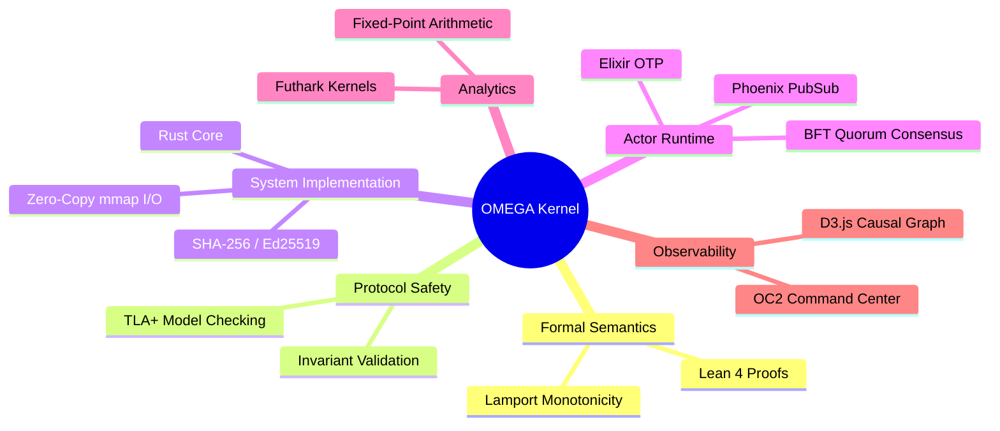
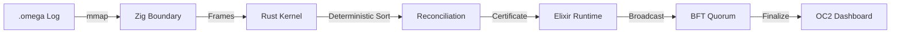

# OMEGA-SHEAF-OS

Formal Distributed Consistency Kernel with Multi-Layer Verification and Real-Time Causal Visualization.

---

## 🗺 System Architecture

### Multi-Layer Verification Mind Map


### Logical Data Flow


---

## 📦 Dependency Matrix

| Layer | Toolchain | Primary Dependencies |
|---|---|---|
| **A: Formal** | `Lean 4` / `elan` | `std` |
| **B: Runtime** | `Elixir 1.16+` / `OTP 26+` | `phoenix_pubsub`, `plug_cowboy`, `jason`, `cors_plug` |
| **C: Systems** | `Zig 0.13.0` | `std.posix` |
| **D: Analytics**| `Futhark` | `std` |
| **E: Model** | `TLA+` / `TLC` | `Java 21+` |
| **F: Kernel** | `Rust 1.75+` | `memmap2`, `sha2`, `ed25519-dalek`, `serde`, `uuid` |
| **G: UI** | `Node.js` / `npm` | `React 19`, `D3.js`, `Tailwind CSS`, `lucide-react` |

---

## 🛠 Command Reference (`omega` CLI)

All CLI operations utilize memory-mapped I/O for zero-copy performance.

### `omega ingest`
Validates binary frame integrity and recovers the last valid prefix.
```bash
omega ingest --input logs/sample.omega
```

### `omega reconcile`
Assembles events into a deterministic batch based on the canonical ordering key.
```bash
omega reconcile --input events.json --batch-id 1 --prior-frontier frontier.bin
```

### `omega certify`
Generates a strictly packed binary envelope signed with Ed25519.
```bash
omega certify --result reconcile.json --batch-id 1 --output cert.bin
```

### `omega explain`
Deconstructs binary certificates into human-readable JSON metadata.
```bash
omega explain --input cert.bin
```

---

## 🖥 OMEGA Command Center (OC2)

The OC2 platform provides real-time observability into the distributed consensus state.

### Quickstart
1. **Initialize and Build**:
   ```bash
   ./scripts/build_all.sh
   ```
2. **Launch Services**:
   ```bash
   ./scripts/start_command_center.sh
   ```
3. **Endpoint**: `http://localhost:4000`

### Visual Interpreters
* **Causal Sheaf**: Graph rendering of the `EventId -> Deps[]` relationship.
* **Quorum Status**: Real-time signature collection metrics per certificate.
* **Chain Audit**: Merkle-lineage verification via `prev_cert_hash`.

---

## 📊 Logic Specifications

### Canonical Ordering Key
Determined by `(lamport, node_id, stream_id, event_id)`. This ensures that state convergence is independent of network arrival order.

### Integrity Contracts
* **Hashing**: SHA-256 packed binary.
* **Signatures**: Ed25519 signatures over rigid binary envelopes.
* **Consensus**: $(n+1)/2$ Quorum requirement for certificate finalization.
* **Arithmetic**: Fixed-point `i32` (1000x scale) for cross-platform analytics determinism.

**License**: Apache-2.0
